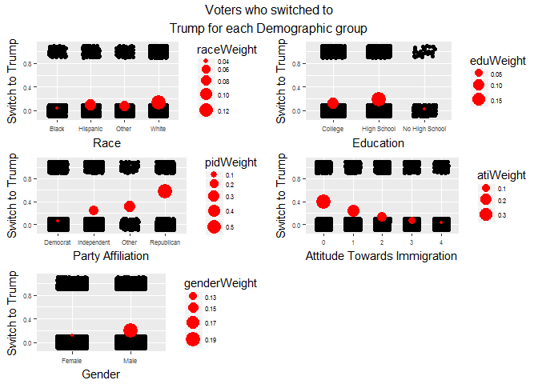
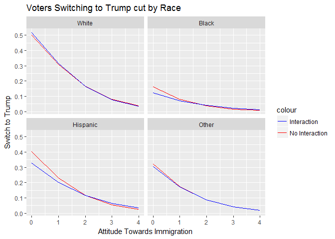
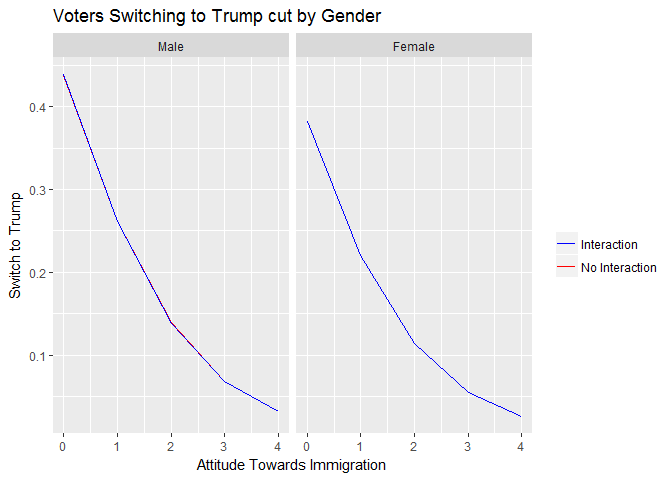
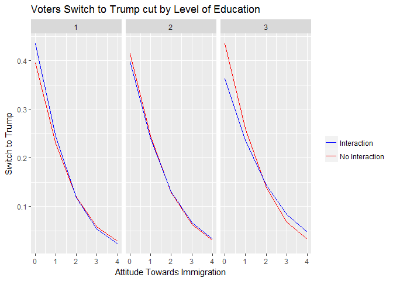
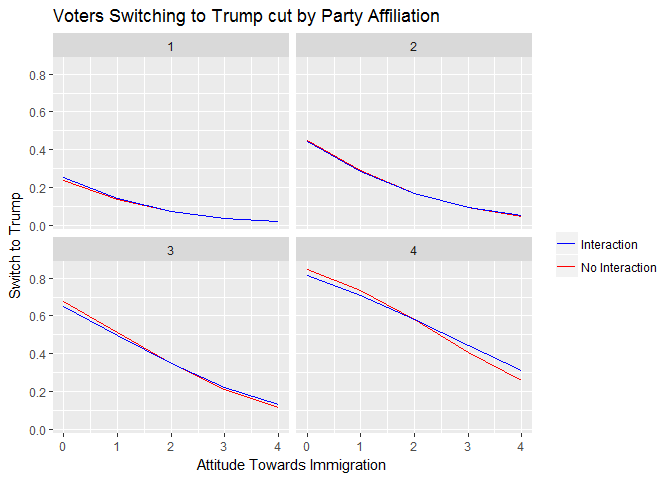
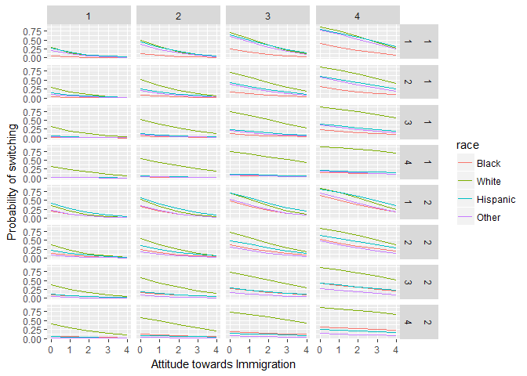
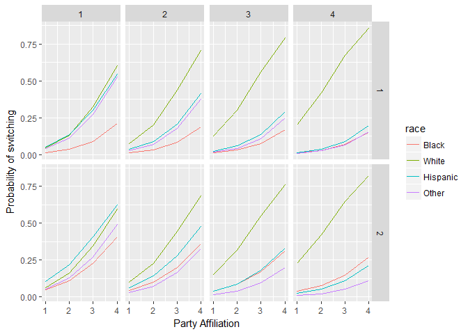
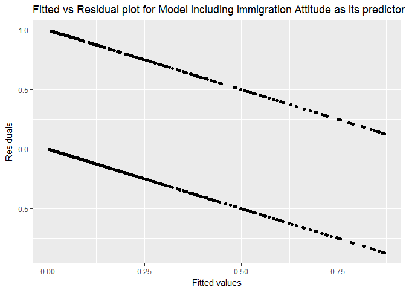
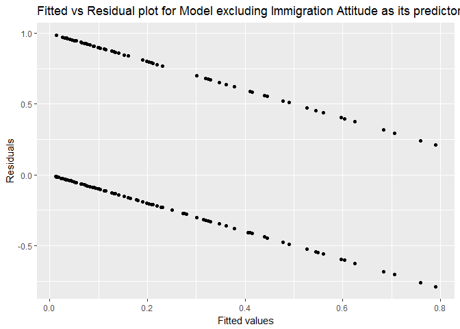

## Introduction

We will be using the data from Cooperative Congressional Election Study(CCES). It is a 50,000+ person national stratified sample survey administered by YouGov. The survey consists of two waves - pre-election phase, respondents answer two-thirds of the questionnaire and the post-election phase, respondents answer the other third of the questionnaire. The spacing of interviews allows researchers to gauge the effects of campaign information and events. \[Credit: [CCES Harvard](https://cces.gov.harvard.edu/)\]

For our research, we will be using data from CCES 2016, Data@CCES\_Harvard(<http://cces.gov.harvard.edu/data>), which consists of a survey of a nationally representative sample of 64,600 adults - CCES16\_Common\_OUTPUT\_Feb2018\_VV.RData.

**We will be addressing the question - To what extent do attitudes toward immigration explains the switching of votes of 2012 Obama supporters who became 2016 Trump supporters?**

We divide our analysis into three sections - first using a single predictor to determine each demographic group that switched to Trump, then we use two predictors and then more than two predictors.

## Section 01: Using One Predictor

To begin, we first derive a variable that measures the respondent's attitude toward immigration. Then, we calculate the weighted proportion for each demographic. We use these variables to see who switched to Trump for every demographic given their attitude towards immigration.

| Immigration Attitude(Numeric) | Immigration Attitude                     |  Weight|
|:------------------------------|:-----------------------------------------|-------:|
| 0                             | Negative Attitude towards Immigrant      |   0.392|
| 1                             | Less Negative Attitude towards Immigrant |   0.245|
| 2                             | Neutral Attitude towards Immigrant       |   0.133|
| 3                             | Less Positive Attitude towards Immigrant |   0.065|
| 4                             | Positive Attitude towards Immigrant      |   0.024|

| Education Level |  Education Level Weight|
|:----------------|-----------------------:|
| College         |                   0.115|
| High School     |                   0.191|
| No High School  |                   0.020|

| Gender |  Gender Weight|
|:-------|--------------:|
| Female |          0.175|
| Male   |          0.141|

| Party Affiliation |  Party Affiliation Weight|
|:------------------|-------------------------:|
| Democrat          |                     0.053|
| Independent       |                     0.246|
| Other             |                     0.312|
| Republican        |                     0.573|

| Race     |  Race Weight|
|:---------|------------:|
| Black    |        0.037|
| Hispanic |        0.090|
| Other    |        0.081|
| White    |        0.138|

From the "Voters who switched to Trump for each Demographic group" graphs we find that,

-   Whites (13%) followed by Hispanics (9%) and Other races (8%) are more likely to switch their votes to Trump in 2016.

-   Black voters (3%) are the least likely to switch their vote to Trump.

-   High School graduates (19%) voters are more likely to switch when compared to College graduates (11%) and no high school (2%) voters.

-   Republicans are more likely to switch, followed by Independents and Other whereas Democrats are the least likely to switch their votes to Trump.

-   Republicans (50%) are 10 times more likely to switch their votes compared to Democrats (5%).

-   Voters more inclined towards immigration (2%) are less likely to switch their votes to Trump and anti-immigrants (40%) voters are more likely to switch their votes to Trump.

-   Males (19%) are more likely to switch their votes to Trump as compared to females (13%).

## Section 02: Using Two Predictors

Now we use both variables (attitude towards immigration and remaining demographic parameters) to see who are more likely to switch their votes to Trump. We fit models and also examine if predictors have an interaction between them.

    ## 
    ## Coefficients for predictors with interaction:

    ##                         Estimate Std. Error t value Pr(>|t|)
    ## (Intercept)               -1.971      0.129 -15.272    0.000
    ## attTwdImmi                -0.602      0.061  -9.836    0.000
    ## raceHispanic               1.247      0.206   6.052    0.000
    ## raceOther                  1.152      0.197   5.832    0.000
    ## raceWhite                  2.038      0.136  14.976    0.000
    ## attTwdImmi:raceHispanic   -0.046      0.090  -0.518    0.604
    ## attTwdImmi:raceOther      -0.161      0.095  -1.699    0.089
    ## attTwdImmi:raceWhite      -0.244      0.064  -3.807    0.000

Looking at the above graph, we find an interaction between attitude towards immigration and race. There is a change in slope between the interaction and non-interaction lines and the coefficient for interaction terms are non-zero.

All races have a negative slope. This means that anti-immigrants across all races have a higher probability to switch their votes to Trump as compared to people who are more accommodating towards immigrants. The probability of White voters switching their votes to Trump is highest followed by Hispanic and Other voters (especially ones who tend to be more anti-immigrant). The Black voters have the least probability of switching their votes.

    ## 
    ## Coefficients for predictors with interaction:

    ##                       Estimate Std. Error t value Pr(>|t|)
    ## (Intercept)             -0.482      0.053  -9.054    0.000
    ## attTwdImmi              -0.785      0.024 -32.051    0.000
    ## genderMale               0.234      0.074   3.153    0.002
    ## attTwdImmi:genderMale   -0.003      0.034  -0.093    0.926

There is no interaction between attitude towards immigration and gender. The coefficient term for interaction is almost zero and there is no change in slopes between the interaction and non-interaction lines.

Gender has a negative slope. Anti-immigrant male and female have a higher probability to switch their votes to Trump as compared to people who are more accommodating towards immigrants. Males are more likely to switch their votes to Trump compared to females.

    ## 
    ## Coefficients for predictors with interaction:

    ##                    Estimate Std. Error t value Pr(>|t|)
    ## (Intercept)          -0.112      0.114  -0.983    0.326
    ## attTwdImmi           -1.003      0.051 -19.616    0.000
    ## educNum              -0.150      0.063  -2.402    0.016
    ## attTwdImmi:educNum    0.130      0.028   4.595    0.000

There is an interaction between attitude towards immigration and education levels. There is a change in slope between the interaction and non-interaction lines and the interaction coefficient is also non-zero.

Level of education has a negative slope. Voters who are more anti-immigrant tend to have a higher probability of switching their votes as compared to the voters who are pro-immigrant. Highly educated voters have the least probability of switching their votes to Trump in 2016 election when compared with No high school and high school graduated voters.

    ## 
    ## Coefficients for predictors with interaction:

    ##                    Estimate Std. Error t value Pr(>|t|)
    ## (Intercept)          -1.935      0.076 -25.498        0
    ## attTwdImmi           -0.787      0.034 -23.322        0
    ## pid7Num               0.850      0.036  23.486        0
    ## attTwdImmi:pid7Num    0.055      0.016   3.492        0

We see that there is a reasonable interaction in our data between the two predictors - attitude towards immigration and party affiliation. There are changes in slope between the interaction and non-interaction lines for most of the parties and the interaction coefficient is non-zero.

The lines have a negative slope. Republican voters, who supported other Republican candidates initially, have also switched to supporting Trump. Both the Other and Republican supporters have the highest the probability of switching their votes. We can observe that voters with the highest negative attitude towards (illegal) immigrants have switched to Trump and the switch decreases as their attitude towards (illegal) immigrants are more accepting. Democrats have the least probability of switching followed by Independent party supporters.

## Section 03 - Using more than two Predictors

Based on the above observations, we now use more than two predictors (one with the attitude towards immigrants and one without) to make predictions on the probability of 2012 Obama supporters switching their votes to Trump in 2016 elections.

We first build a model including attitude towards immigration as a predictor. For the model, we include interaction between

-   party affiliation - gender, race
-   race - gender, education and
-   attitude towards immigration - party affiliation, race, education

We exclude interaction between attitude towards immigration and gender (based on analysis done in Section 02) and gender & education and party affiliation & education (p-value is around 0.9). Looking at the fitted vs residuals plot (attached in the appendix), we find the curve is near zero and has small confidence bands. The model is a good fit.

    ## 
    ## Coefficients for model (including the attitude towards immigration as a predictor):

    ##                         Estimate Std. Error t value Pr(>|t|)
    ## (Intercept)               -4.575      0.419 -10.921    0.000
    ## attTwdImmi                -0.894      0.087 -10.328    0.000
    ## pid7Num                    0.945      0.107   8.809    0.000
    ## genderNum                  1.497      0.181   8.256    0.000
    ## raceHispanic               2.939      0.602   4.886    0.000
    ## raceOther                  3.088      0.603   5.124    0.000
    ## raceWhite                  2.261      0.415   5.454    0.000
    ## educNum                   -0.432      0.141  -3.056    0.002
    ## pid7Num:genderNum         -0.155      0.042  -3.707    0.000
    ## pid7Num:raceHispanic      -0.027      0.108  -0.253    0.800
    ## pid7Num:raceOther          0.067      0.110   0.613    0.540
    ## pid7Num:raceWhite          0.104      0.080   1.303    0.193
    ## genderNum:raceHispanic    -0.725      0.250  -2.893    0.004
    ## genderNum:raceOther       -1.306      0.265  -4.923    0.000
    ## genderNum:raceWhite       -1.036      0.178  -5.806    0.000
    ## raceHispanic:educNum      -0.438      0.201  -2.185    0.029
    ## raceOther:educNum         -0.448      0.229  -1.955    0.051
    ## raceWhite:educNum          0.494      0.138   3.571    0.000
    ## attTwdImmi:pid7Num         0.062      0.016   3.770    0.000
    ## attTwdImmi:raceHispanic   -0.003      0.093  -0.033    0.973
    ## attTwdImmi:raceOther      -0.067      0.100  -0.668    0.504
    ## attTwdImmi:raceWhite      -0.176      0.066  -2.655    0.008
    ## attTwdImmi:educNum         0.136      0.031   4.346    0.000

Looking at the graph (next page), we see that the model does a good job of predicting. The probability of switching is highest with white and least with black voters. The more the voters tend to be anti-immigrant, the higher their probability of switch. High educated voters and democrat supporters tend to have lesser probability of switching.

Next, we build a model excluding attitude towards immigration as a predictor. For the model, we include interaction between

-   party affiliation - gender, race, education
-   gender - race, education and
-   race - education

<!-- -->

    ## 
    ## Coefficients for model (excluding the attitude towards immigration as a predictor):

    ##                        Estimate Std. Error t value Pr(>|t|)
    ## (Intercept)              -6.827      0.476 -14.327    0.000
    ## pid7Num                   1.153      0.119   9.723    0.000
    ## genderNum                 1.556      0.226   6.873    0.000
    ## raceHispanic              2.380      0.565   4.215    0.000
    ## raceOther                 2.641      0.572   4.618    0.000
    ## raceWhite                 1.467      0.405   3.622    0.000
    ## educNum                   0.079      0.196   0.402    0.687
    ## pid7Num:genderNum        -0.132      0.040  -3.276    0.001
    ## pid7Num:raceHispanic      0.035      0.107   0.325    0.745
    ## pid7Num:raceOther         0.088      0.109   0.808    0.419
    ## pid7Num:raceWhite         0.169      0.080   2.119    0.034
    ## pid7Num:educNum          -0.035      0.034  -1.023    0.306
    ## genderNum:raceHispanic   -0.625      0.249  -2.510    0.012
    ## genderNum:raceOther      -1.099      0.263  -4.182    0.000
    ## genderNum:raceWhite      -0.987      0.178  -5.542    0.000
    ## genderNum:educNum        -0.073      0.078  -0.940    0.347
    ## raceHispanic:educNum     -0.395      0.198  -1.994    0.046
    ## raceOther:educNum        -0.469      0.231  -2.031    0.042
    ## raceWhite:educNum         0.586      0.138   4.241    0.000

Looking at the above graph, we see that the model does a good job of predicting and is similar to the model with the attitude towards immigration as one of its predictors. The probability of switching is highest with white and least with black voters. High educated voters and democrat supporters tend to have lesser probability of switching.

## CONCLUSION

We begin the analysis by deriving a new feature "Attitude of Voters towards Immigration". Plotting each demographic against the probability of switch we find certain white voters with republican affiliation mostly male with education less than a college degree have a higher probability of switching and voting for Trump in 2016 elections. While blacks and Democrats have the least probability of switching their votes. The voters' attitude towards immigration feature does play a major role in the predictions.

During the election campaign, Trump was infamous for his derogatory remarks against women, disapproval of certain religion and tighter immigration laws. The data analysis also reveals that women have comparatively a lower probability of switching their votes to Trump along with non-white races. But these comments, have also swayed the white men towards Trump, as shown in the graphs, wherein they have a higher probability of switch.

## APPENDIX

