``` r
library(gapminder)
library(ggplot2)
library(tidyr)
library(broom)
library(gridExtra)
library(GGally)
```

Introduction:
-------------

Gapminder Foundation (Gapminder.org) is a non-profit venture that promotes sustainable global development and achievement of the United Nations Millennium Development Goals. It uses statistics and social, economic and environmental development information at local, national and global levels to achieve the goals. \[Source: [Wikipedia](https://en.wikipedia.org/wiki/Gapminder_Foundation)\]

Gapminder package contains values for life expectancy, GDP per capita, and population for every five years, from 1952 to 2007, for 142 countries from five continents. \[Source: [CRAN.R](https://cran.r-project.org/web/packages/gapminder/index.html)\]

#### We will mainly address the following question - Does increase in life expectancy since World War 2 be largely explained by increases in GDP per capita?

To answer this, we focus on performing data analysis on the explanatory variables year (ranges from 1952 to 2007 in increments of 5 years), lifeExp (Life Expectancy in years), pop (population), and gdpPercap (GDP per capita \[US$, inflation-adjusted\]).

We divide our analysis into three sections - GDP and life expectancy in 2007, Life expectancy over time by continent, and Changes in the relationship between GDP and life expectancy over time.

Section 1: GDP and life expectancy in 2007
------------------------------------------

We begin the analysis by looking at trend between GDP and life expectancy in 2007 for all the continents.

``` r
s = subset(gapminder,year=="2007")
conasia=subset(s,continent=='Asia')
coneurope=subset(s,continent=='Europe')
conafrica=subset(s,continent=='Africa')
conamericas=subset(s,continent=='Americas')
conoceania=subset(s,continent=='Oceania')

#Linear Model Fit for the Continents
cont.lm = ggplot(s,aes(x=gdpPercap,y = lifeExp)) + geom_point() + geom_smooth(method="lm")+facet_wrap(~continent,ncol=2,scales = "free")+ggtitle("Linear Model Fit for the GDP vs LifeExpectancy for Continents")+ 
   labs(x = 'GDP per Capita', y = 'Life Expectancy', title = 'Linear Model - Life Expectancy vs GDP per Capita in 2007')
```

Looking at the linear model plots (attached in Appendix), we found that it doesn't capture the trend of GDP per Capita vs Life Expectancy for all continents. For example, most of the African countries have a GDP of less than 2500$ and very few countries with GDP greater than 2500$.

And so, we use loess model. It is a nonparametric method that fits a smooth line through a time plot or scatterplot to help assess the relationship between variables and foresee trends. It is used when we have noisy data, sparse data points or weak inter-relationships that interfere with fitting a line of best fit. We will also be performing log transformation on the data to improve the fit. [1]

From the graphs, with respect to GDP and life expectancy in 2007, we can see that:

-   Africa has a linear increase with more countries having lower GDP and lower life expectancy and few countries with high GDP and life expectancy.

-   America's trends are best described by a loess curve, with most countries having high GDP and life expectancy (centered around 72).

-   Europe also has a linear increase in GDP and life expectancy. There are a few outliers - few countries have higher GDP but have comparatively lower life expectancy with countries having the same GDP.

-   Asia is also best described by a loess curve, with countries being spread out on the curve. It has countries with low, medium and high GDP and life expectancy, with more data cluttered around the ends.

-   We did not consider Oceania as it has only two data points and it is not possible to fit any models for that continent.

Even though we find a linear relationship between GDP and life expectancy, there a number of additional parameters to be considered for estimating life expectancy like health-care available, social factors, etc.

Looking at the "Life Expectancy vs GDP 2007" graph (next page), we can see that life expectancy is increasing as GDP is increasing in each country of the continent. We can see that all the countries have an additive shift - the lines are parallel to one another with different means.

``` r
#Checking Linear Model for Africa. We choose loess with span = 0.5

afrigg = ggplot(conafrica, aes(x=log10(gdpPercap),y = lifeExp)) + geom_point() + geom_smooth(method = lm)+facet_wrap(~continent,ncol=2,scales = "free")+labs(x = 'Log transformed GDP per Capita', y = 'Life Expectancy', title = 'Linear Model - Africa')

conafrica.lm = lm(lifeExp~log10(gdpPercap), data = conafrica)
conafrica.lm.df = augment(conafrica.lm)

#variance 
```

``` r
#Checking Linear Model for Americas

amergg = ggplot(conamericas, aes(x=log10(gdpPercap),y = lifeExp)) + geom_point() + geom_smooth()+facet_wrap(~continent,ncol=2,scales = "free")+labs(x = 'Log transformed GDP per Capita', y = 'Life Expectancy', title = 'Loess Curve - Americas')

conamericas.lo = loess(lifeExp~log10(gdpPercap), data = conamericas)
conamericas.lo.df = augment(conamericas.lo)
```

``` r
#Checking Linear Model for Asia. We choose loess because of the blue line around the zero line and data is within C.I. for fitted and residual plot

asiagg = ggplot(conasia, aes(x=log10(gdpPercap),y = lifeExp)) + geom_point() + geom_smooth()+facet_wrap(~continent,ncol=2,scales = "free")+labs(x = 'Log transformed GDP per Capita', y = 'Life Expectancy', title = 'Loess Curve - Asia')

conasia.lo = loess(lifeExp~log10(gdpPercap), data = conasia)
conasia.lo.df = augment(conasia.lo)
```

``` r
#Checking Linear Model for Europe

# eurogg = ggplot(coneurope, aes(x=log10(gdpPercap),y = lifeExp)) + geom_point(span=0.25) + geom_smooth()+facet_wrap(~continent,ncol=2,scales = "free")+labs(x = 'Log transformed GDP per Capita', y = 'Life Expectancy', title = 'Loess Curve - Europe')
# 
# coneurope.lo = loess(lifeExp~log10(gdpPercap), data = coneurope)
# coneurope.lo.df = augment(coneurope.lo)

eurolm = ggplot(coneurope, aes(x=log10(gdpPercap),y = lifeExp)) + geom_point() + geom_smooth(method="lm") + facet_wrap(~continent,ncol=2,scales = "free")+labs(x = 'Log transformed GDP per Capita', y = 'Life Expectancy', title = 'Linear Model - Europe')

coneurope.lm = lm(lifeExp~log10(gdpPercap), data = coneurope)
coneurope.lm.df = augment(coneurope.lm)
```

``` r
grid.arrange(afrigg, amergg, asiagg, eurolm, top = "Log10(GDP) vs LifeExpectancy for each continent")
```

    ## `geom_smooth()` using method = 'loess'
    ## `geom_smooth()` using method = 'loess'

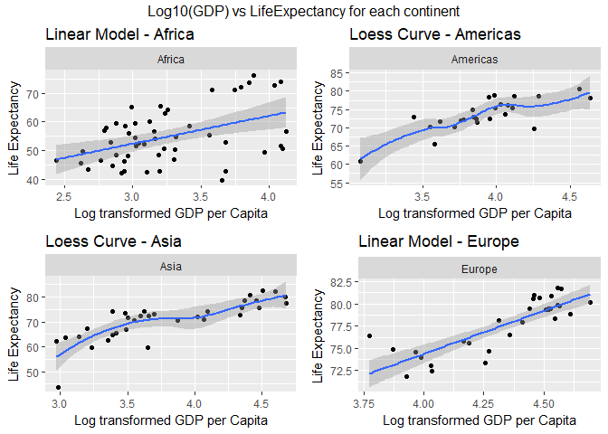

``` r
#grid.arrange(eurogg, eurolm, top = "Log10(GDP) vs LifeExpectancy for each continent")

cat("The model captures ", var(conafrica.lm.df$.fitted)/var(conafrica$lifeExp)*100,"% of variance in the data for Africa in 2007.")
```

    ## The model captures  20.38938 % of variance in the data for Africa in 2007.

``` r
cat("\nThe model captures ", var(conamericas.lo.df$.fitted)/var(conamericas$lifeExp)*100,"% of variance in the data for Americas in 2007.")
```

    ## 
    ## The model captures  73.44411 % of variance in the data for Americas in 2007.

``` r
cat("\nThe model captures ", var(conasia.lo.df$.fitted)/var(conasia$lifeExp)*100,"% of variance in the data for Asia in 2007.")
```

    ## 
    ## The model captures  69.50029 % of variance in the data for Asia in 2007.

``` r
# cat("\nThe model captures ", var(coneurope.lo.df$.fitted)/var(coneurope$lifeExp)*100,"% of variance in the data for Europe in 2007.")
cat("\nThe model captures ", var(coneurope.lm.df$.fitted)/var(coneurope$lifeExp)*100,"% of variance in the data for Europe in 2007.")
```

    ## 
    ## The model captures  69.86601 % of variance in the data for Europe in 2007.

``` r
rm(afrigg, amergg, asiagg, eurogg, eurolm)
```

``` r
cont07gg = ggplot(s,aes(x=log10(gdpPercap),y=lifeExp,group = continent,color=continent)) + geom_point(alpha=.3) + geom_smooth(method="lm",alpha=.1)+ labs(x = 'Log of GDP per Capita', y = 'Life Expectancy', title = 'Life Expectancy vs GDP - 2007')

continent.asia=subset(gapminder,continent=='Asia')
continent.europe=subset(gapminder,continent=='Europe')
continent.africa=subset(gapminder,continent=='Africa')
continent.america=subset(gapminder,continent=='Americas')
continent.oceania=subset(gapminder,continent=='Oceania')

lifeExp.time.asia=c()
lifeExp.time.africa=c()
lifeExp.time.america=c()
lifeExp.time.europe=c()
lifeExp.time.oceania=c()
year=c(1952,1957,1962,1967,1972,1977,1982,1987,1992,1997,2002,2007)

j=1
for(i in year){
  lifeExp.time.asia[j]=weighted.mean(continent.asia$lifeExp[continent.asia$year==i],continent.asia$pop[continent.asia$year==i])  
  lifeExp.time.africa[j]=weighted.mean(continent.africa$lifeExp[continent.africa$year==i],continent.africa$pop[continent.africa$year==i])  
  lifeExp.time.america[j]=weighted.mean(continent.america$lifeExp[continent.america$year==i],continent.america$pop[continent.america$year==i])  
  lifeExp.time.europe[j]=weighted.mean(continent.europe$lifeExp[continent.europe$year==i],continent.europe$pop[continent.europe$year==i])  
  lifeExp.time.oceania[j]=weighted.mean(continent.oceania$lifeExp[continent.oceania$year==i],continent.oceania$pop[continent.oceania$year==i])  
  j=j+1
}

continent.weight=data.frame(year,lifeExp.time.africa,lifeExp.time.america,lifeExp.time.asia,lifeExp.time.europe,lifeExp.time.oceania)
names(continent.weight)=c('year','Africa','America','Asia','Europe','Oceania')

continent.weight.long=continent.weight %>% gather(Continent,AvgLifeExp,Africa:Oceania)

contgg = ggplot(continent.weight.long,aes(x=year,y=AvgLifeExp,group = Continent,color=Continent))+geom_point()+geom_line()+ylab('Average Life Expectancy (in years)')+xlab('Year')+ggtitle('Life Expectancy Over Time')#+geom_smooth(method.args=list(degree=1))

grid.arrange(cont07gg, contgg, ncol=2, heights=c(3,1))
```


``` r
rm(s, conasia, coneurope, conafrica, conamericas, conoceania, cont07gg, contgg)
```

Section 2: Life expectancy over time by continent
-------------------------------------------------

Next, we start analyzing life expectancy over time for each continent. We begin the analysis by calculating the weighted average life expectancy and then use this data for plotting the average life expectancy against each year.

By observing the "Life Expectancy Over Time" graph (above), we deduce that average life expectancy increases linearly over the years for all the continents - with Oceania having the highest and African countries having the lowest average life expectancy from 1952 to 2007.

Oceania, Europe, and America have a head start compared to other continents with life expectancy above 60 at 1952. Asia, with life expectancy at around 40 in 1952, has the steepest growth. It nears America's average life expectancy - starting with gap of 18 years at 1952 to a gap of 5 years in 2007.

Africa has the slowest growth rate with average life expectancy starting at below 40 years and reaching 55 years near 2007. Even though the growth is linear till 1990's, it drops a till at 1992 and raises again after 2002.

We use "&lt;Continent\_Name&gt; - Trend" graphs to display some of the most populous countries in each continent. These countries best describe how they affect average life expectancy over the years in that continent.

``` r
asia.subset=subset(continent.asia,continent=='Asia' & (country=="India" |
                                                       country=="China" |
                                                       country=="Japan" |
                                                       country=="Bangladesh" |
                                                       country=="Indonesia"),stringsAsFactors=FALSE)
asia.subset$country <- as.character(asia.subset$country)
for (i in year){
  apop = sum(as.numeric(continent.asia$pop[continent.asia$year==i &
                                                       continent.asia$country!="India" &
                                                       continent.asia$country!="China" &
                                                       continent.asia$country!="Japan" &
                                                       continent.asia$country!="Bagladesh" &
                                                       continent.asia$country!="Indonesia"]))
  agdpPerCap = mean(as.numeric(continent.asia$gdpPercap[continent.asia$year==i &
                                                       continent.asia$country!="India" &
                                                       continent.asia$country!="China" &
                                                       continent.asia$country!="Japan" &
                                                       continent.asia$country!="Bagladesh" &
                                                       continent.asia$country!="Indonesia"]))
  alifeExp = mean(as.numeric(continent.asia$lifeExp[continent.asia$year==i &
                                                       continent.asia$country!="India" &
                                                       continent.asia$country!="China" &
                                                       continent.asia$country!="Japan" &
                                                       continent.asia$country!="Bagladesh" &
                                                       continent.asia$country!="Indonesia"]))
  asia.subset[nrow(asia.subset) + 1,] = list("Others", "Asia", i, alifeExp, apop, agdpPerCap)
}

asiagg = ggplot(asia.subset,aes(x=year,y=lifeExp,group = country,color=country))+geom_point()+geom_line()+ylab('Avg. Life Expectancy')+xlab('Year')+ggtitle('Asia - Trend')+scale_colour_brewer(palette = "Dark2")+theme(axis.text=element_text(size=8),legend.text=element_text(size=8),legend.key.height = unit(.25,"cm"))

rm(asia.subset)
```

``` r
africa.subset=subset(continent.africa,continent=='Africa' & (country=="South Africa" |
                                                       country=="Egypt" |
                                                       country=="Nigeria" |
                                                       country=="Congo, Dem. Rep." |
                                                       country=="Ethiopia"))
africa.subset$country <- as.character(africa.subset$country)
for (i in year){
  apop = sum(as.numeric(continent.africa$pop[continent.africa$year==i &
                                                       continent.africa$country!="South Africa" &
                                                       continent.africa$country!="Egypt" &
                                                       continent.africa$country!="Nigeria" &
                                                       continent.africa$country!="Congo, Dem. Rep." &
                                                       continent.africa$country!="Ethiopia"]))
  agdpPerCap = mean(as.numeric(continent.africa$gdpPercap[continent.africa$year==i &
                                                       continent.africa$country!="South Africa" &
                                                       continent.africa$country!="Egypt" &
                                                       continent.africa$country!="Nigeria" &
                                                       continent.africa$country!="Congo, Dem. Rep." &
                                                       continent.africa$country!="Ethiopia"]))
  alifeExp = mean(as.numeric(continent.africa$lifeExp[continent.africa$year==i &
                                                       continent.africa$country!="South Africa" &
                                                       continent.africa$country!="Egypt" &
                                                       continent.africa$country!="Nigeria" &
                                                       continent.africa$country!="Congo, Dem. Rep." &
                                                       continent.africa$country!="Ethiopia"]))
  africa.subset[nrow(africa.subset) + 1,] = list("Others", "africa", i, alifeExp, apop, agdpPerCap)
}

africagg = ggplot(africa.subset,aes(x=year,y=lifeExp,group = country,color=country))+geom_point()+geom_line()+ylab('Avg. Life Expectancy')+xlab('Year')+ggtitle('Africa - Trend')+scale_colour_brewer(palette = "Dark2")+theme(axis.text=element_text(size=8),legend.text=element_text(size=8),legend.key.height = unit(.25,"cm"))

rm(africa.subset)
```

``` r
americas.subset=subset(continent.america,continent=='Americas' & (country=="United States" |
                                                       country=="Brazil" |
                                                       country=="Argentina" |
                                                       country=="Mexico" |
                                                       country=="Canada"))
americas.subset$country <- as.character(americas.subset$country)
for (i in year){
  apop = sum(as.numeric(continent.america$pop[continent.america$year==i &
                                                       continent.america$country!="United States" &
                                                       continent.america$country!="Brazil" &
                                                       continent.america$country!="Argentina" &
                                                       continent.america$country!="Mexico" &
                                                       continent.america$country!="Canada"]))
  agdpPerCap = mean(as.numeric(continent.america$gdpPercap[continent.america$year==i &
                                                       continent.america$country!="United States" &
                                                       continent.america$country!="Brazil" &
                                                       continent.america$country!="Argentina" &
                                                       continent.america$country!="Mexico" &
                                                       continent.america$country!="Canada"]))
  alifeExp = mean(as.numeric(continent.america$lifeExp[continent.america$year==i &
                                                       continent.america$country!="United States" &
                                                       continent.america$country!="Brazil" &
                                                       continent.america$country!="Argentina" &
                                                       continent.america$country!="Mexico" &
                                                       continent.america$country!="Canada"]))
  americas.subset[nrow(americas.subset) + 1,] = list("Other", "Americas", i, alifeExp, apop, agdpPerCap)
}

americasgg = ggplot(americas.subset,aes(x=year,y=lifeExp,group = country,color=country))+geom_point()+geom_line()+ylab('Avg. Life Expectancy')+xlab('Year')+ggtitle('Americas - Trend')+scale_colour_brewer(palette = "Dark2")+theme(axis.text=element_text(size=8),legend.text=element_text(size=8),legend.key.height = unit(.25,"cm"))

rm(americas.subset)
```

``` r
europe.subset=subset(continent.europe,continent=='Europe' & (country=="United Kingdom" |
                                                       country=="Turkey" |
                                                       country=="France" |
                                                       country=="Germany" |
                                                       country=="Poland"))
europe.subset$country <- as.character(europe.subset$country)
for (i in year){
  apop = sum(as.numeric(continent.europe$pop[continent.europe$year==i &
                                                       continent.europe$country!="United Kingdom" &
                                                       continent.europe$country!="Turkey" &
                                                       continent.europe$country!="France" &
                                                       continent.europe$country!="Germany" &
                                                       continent.europe$country!="Poland"]))
  agdpPerCap = mean(as.numeric(continent.europe$gdpPercap[continent.europe$year==i &
                                                       continent.europe$country!="United Kingdom" &
                                                       continent.europe$country!="Turkey" &
                                                       continent.europe$country!="France" &
                                                       continent.europe$country!="Germany" &
                                                       continent.europe$country!="Poland"]))
  alifeExp = mean(as.numeric(continent.europe$lifeExp[continent.europe$year==i &
                                                       continent.europe$country!="United Kingdom" &
                                                       continent.europe$country!="Turkey" &
                                                       continent.europe$country!="France" &
                                                       continent.europe$country!="Germany" &
                                                       continent.europe$country!="Poland"]))
  europe.subset[nrow(europe.subset) + 1,] = list("Other", "europe", i, alifeExp, apop, agdpPerCap)
}

europegg = ggplot(europe.subset,aes(x=year,y=lifeExp,group = country,color=country))+geom_point()+geom_line()+ylab('Avg. Life Expectancy')+xlab('Year')+ggtitle('Europe - Trend')+scale_colour_brewer(palette = "Dark2")+theme(axis.text=element_text(size=8),legend.text=element_text(size=8),legend.key.height = unit(.25,"cm"))

rm(europe.subset)

oceaniagg = ggplot(continent.oceania,aes(x=year,y=lifeExp,group = country,color=country))+geom_point()+geom_line()+ylab('Avg. Life Expectancy')+xlab('Year')+ggtitle('Oceania - Trend')+scale_colour_brewer(palette = "Dark2")+theme(axis.text=element_text(size=8),legend.text=element_text(size=8),legend.key.height = unit(.25,"cm"))

grid.arrange(asiagg,africagg,americasgg, europegg, oceaniagg, ncol=2)
```

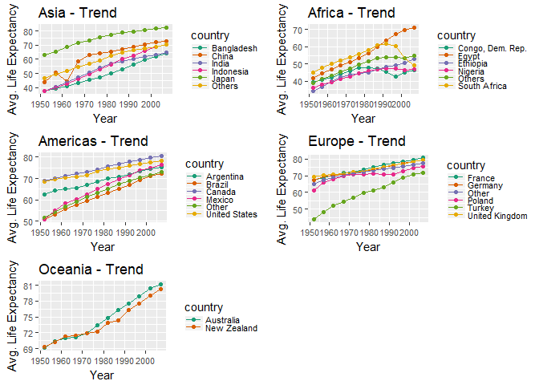

``` r
rm(asiagg,africagg,americasgg, europegg, oceaniagg)
rm(lifeExp.time.asia, lifeExp.time.africa, lifeExp.time.america, lifeExp.time.europe, lifeExp.time.oceania, year, continent.weight, continent.weight.long)
```

#### Oceania:

-   There is a steady growth till 1975, after which the growth is faster.

#### Americas:

-   The United States and Canada have the highest population with very high average life expectancy, between 70 to 80 years.

-   Brazil, Mexico, and Argentina are the next highly populated countries having a comparitively lower life expectancy, between 50 to 70.

-   The average value of these five countries put together represent the average life expectancy of Americas.

#### Europe:

-   There is a very slight dip in the life expectancy that starts around 1980.

-   The fall of Soviet Union around 1980's reduced the life expectancy of Eastern European countries (eg. Poland) due to a poor economy and lack of good healthcare facilities.

-   We also observe that even though there is an increase in the average life expectancy in Eastern European bloc after 1995, it is comparatively lower in central and western Europe.

#### Asia:

-   Since India and China share approximately 60% of the population in Asia, most of the anomalies can be explained using them.

-   There is a drop in average life expectancy between the years 1955 and 1965 in the "Life Expectancy Over Time" graph.

    -   China and India had a life expectancy of around 40 during these years, bringing down the life expectancy of Asia to around 45 years. Even though Japan has an average life expectancy near 70 years and rest of the countries at around 52 years.

    -   China suffered from a great famine which claimed an estimated 30 million lives.

    -   The famine also reduced the birth rate in China during these years.

    -   Since 1972, there has been a steady growth in life expectancy in China.

-   India's life expectancy was linearly growing from 1952 to 1990 but it is low compared to other populated countries.

-   Also, at around 1990's India's life expectancy starts flattening. During the late 1990's and early 2000's, India lost around 2.5 million lives to AIDS, and also saw a dip in its average life expectancy.

-   At 2007, we can see that India and China have a life expectancy at 60 and 68 respectively which marks Asia's life expectancy at around 65's years.

#### Africa:

-   Life expectancy is growing linearly till 1990 after which drops a little at 1990 and raises at 2002.

-   The are numerous reason for this drop. Some of them are described below,

    -   AIDS and tuberculosis epidemic which hit South Africa in late 90's.

    -   It was estimated that South Africa had lost at least 17 years of average life expectancy to the AIDS epidemic by 2000-2005.

    -   Younger age groups were affected by AIDS more and lost their lives quiet early (nearly a quarter million deaths were caused in Ethiopia and Nigeria.)

    -   The neonatal death rate (due to poor health-care facilities) was severely high in some African countries (South Africa, Nigeria).

    -   Regional politics in Nigeria around 1990's also contributed to a higher percentage of deaths, bringing down Africa's life expectancy.

Section 3: Changes in the relationship between GDP and life expectancy over time
--------------------------------------------------------------------------------

Now we start analyzing the relation between GDP and life expectancy over time. We begin by plotting GDP vs life expectancy for each continent and then look at how these variables have changed over the years. GDP per capita is log transformed to ease our analysis. We divide our discussion in two parts.

#### Part 1:

From the first graph, we get a linear model of log10 GDP per capita as an explanatory variable and life expectancy as a response variable for each continent. Therefore, the life expectancy in each continent is growing linearly by 10 units increase in GDP. This could be a good indicator to substantiate the claim that, as countries gain more money, they invest in better healthcare facilities.

Over the years they are racing against each other to either catch-up or outperform. Americas has the steepest rise, while Asia and Europe have a normal rise.

As explained before, the major contribution to Americas came from the USA and Canada (the steep slope exists because of these two) which were working towards better healthcare policies and medical research. This kept their life expectancy around 50 years and a comparatively higher GDP than the rest of the continents.

Initially, Europe has a steep rise but then it becomes somewhat constant. This is because after World War II, both the USA and Soviet were competing in Cold War and making efforts to rise but after the Soviet collapsed, there was an economic burden in eastern and central Europe. To support our claim, we found the following - "Between 1970 and the end of the 1980s, life expectancy at birth in the former communist countries of CEE (Czech Republic, Hungary, Poland, and Slovakia), Russia and the Baltic states (Estonia, Latvia and Lithuania) stagnated or declined. This led to an increasing gap between them and Western European countries as the latter steadily improved. However, within a few years of the collapse of the Berlin wall in 1989, life expectancy started to steadily increase." \[8\]

Asia has the broadest rise from a very low GDP (of about 800 GDP per Capita) and life expectancy (of about 45 years) to very high values of (100,000 GDP per Capita) and life expectancy (of 82 years).

Africa is the only continent to show a very slow minimal rise both in terms of GDP and life expectancy. But we also need to note that there is a wider standard deviation towards the ends, especially in Asia, though over the years it tends to reduce.

#### Part 2:

We can also divide the second graph into 4 regions where GDP per cap axis ranges from poor to rich and Life Expectancy axis ranging from sick to healthy We observe that from 1952 to 1966, most of the African countries fall in a poor country with sick people but this scenario changes after 1960 where some countries are getting richer and investing in healthcare. This trend continues till the start of 90's after which few countries have comparatively less sick lives than the 50's but a lower GDP than the early 90's.

Asia has a wide range of poor and sick countries to rich and healthy countries. This has remained consistent over the entire time period with life expectancy increasing every five years. There is a period from 2002 to 2007 where Asia has caught-up with Europe and America in terms of both GDP and Life Expectancy.

We observe that the poorest and the sickest people of American countries were not as sick and poor as African and Asian countries. This holds true over all the years. European countries beat all the other countries of the world by being the richest of all and healthier than the rest from 1966 to 1989. In the later period, they focussed on their health and remained consistent with their wealth. But some European countries as discussed above, caused to widen the gap and led Europe fall among other poor and sick countries of the world.

We do not have much data points to comment on Oceania countries but they seem to have rich and healthy people over the entire time period.

``` r
plot1 = ggplot(gapminder,aes(x = log10(gdpPercap), y = lifeExp, group = continent, color = continent))+ theme(strip.text.y = element_text(angle = 0))+geom_smooth(method=lm)+ labs(x = 'Log of GDP per Capita', y = 'Life Expectancy', title = 'Life Expectancy vs GDP')

plot2 = ggplot(gapminder,aes(x = log10(gdpPercap), y = lifeExp, group = continent, color = continent))+facet_wrap(~cut_number(as.numeric(year),n = 12), ncol = 3) +   theme(strip.text.y = element_text(angle = 0))+geom_smooth(method=lm, alpha=0.2)+ labs(x = 'Log of GDP per Capita', y = 'Life Expectancy', title = 'Life Expectancy vs GDP per Year')

grid.arrange(plot1, plot2, ncol=2, heights=c(250), widths=c(15,20))
```

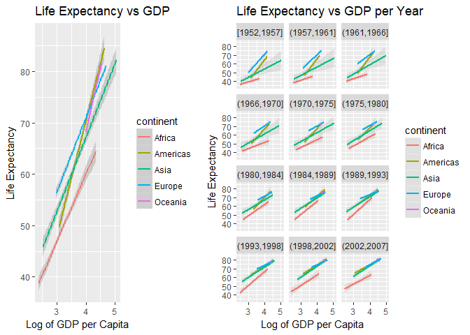

``` r
rm(plot1, plot2)
```

Conclusion:
-----------

Even though looking at the graphs we can find there is a linear relationship between the logarithmic scale of GDP per capita and life expectancy, it is unwise to arrive at such a conclusion. From the standard deviation bands in the graphs, we can see that different countries have different life expectancy even though they have nearly the same GDP.

There are endogenous factors that need to be considered as well - such as regional politics, natural disasters, and epidemics that have disabled the progress of a nation. For example, **Africa** holds 30% of the world's natural resources and is considered as the world's 10 fastest-growing economies, but it also has the slowest growth rate for life expectancy and **Eastern Europe** not withstanding the consequences of the collapse of communism shows how abrupt political, economic and social changes could have serious adverse effects on population health.

References:
-----------

\[1\] <http://www.pilibrary.com/articles1/political%20experiences%20in%20nigeria.htm>

\[2\] <http://www.aljazeera.com/indepth/interactive/2016/10/mapping-africa-natural-resources-161020075811145.html>

\[3\] <https://www.un.org/press/en/2001/aids18.doc.htm>

\[4\] <http://www.who.int/gho/mortality_burden_disease/life_tables/situation_trends_text/en/>

\[5\] <https://www.iol.co.za/news/south-africa/western-cape/four-reasons-for-sas-low-life-expectancy-1798106>

\[6\] <https://en.wikipedia.org/wiki/Great_Leap_Forward>

\[7\] <http://www.statisticshowto.com/lowess-smoothing/>

\[8\] <https://academic.oup.com/ije/article/40/2/271/735545>

\[9\] IVMOOC 2018, Prof. Katy Borner, <https://www.youtube.com/watch?v=9n190RiFXIo&feature=youtu.be>

### Appendix:

``` r
grid.arrange(cont.lm)
```


``` r
conafrlm=ggplot(conafrica.lm.df,aes(x = log10.gdpPercap., y = .resid))+ geom_point()+ geom_smooth(span=0.5)+geom_abline(slope = 0, intercept = 0)
africafr.lm = ggplot(conafrica.lm.df,aes(x =.fitted, y = sqrt(abs(.resid))))+ geom_point()+ geom_smooth()
grid.arrange(conafrlm, africafr.lm, ncol=2, top="Africa -  Residual Plot & Fitted vs Residual Plot")
```

    ## `geom_smooth()` using method = 'loess'
    ## `geom_smooth()` using method = 'loess'

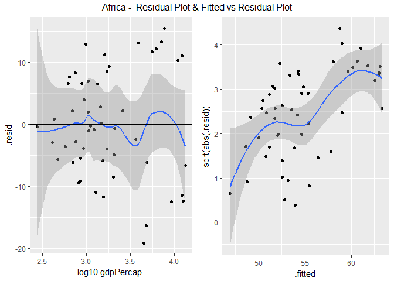

``` r
rm(conafrlm, conafrica.lm.df, conafrica.lm, africafr.lm)

conamrlo=ggplot(conamericas.lo.df,aes(x = log10.gdpPercap., y = .resid))+ geom_point()+ geom_smooth()+geom_abline(slope = 0, intercept = 0)
americas.lo = ggplot(conamericas.lo.df,aes(x =.fitted, y = sqrt(abs(.resid))))+ geom_point()+ geom_smooth()+geom_abline(slope = 0, intercept = 0)

grid.arrange(conamrlo,americas.lo, ncol=2, top="Americas -  Residual Plot & Fitted vs Residual Plot")
```

    ## `geom_smooth()` using method = 'loess'
    ## `geom_smooth()` using method = 'loess'

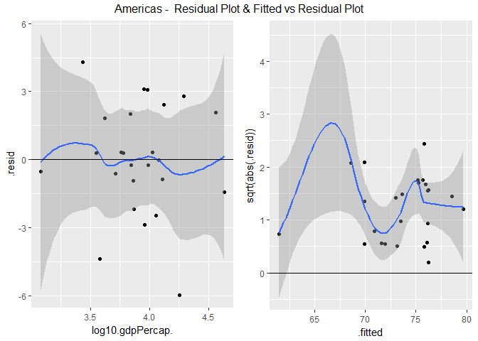

``` r
rm(conamericas.lo, conamericas.lo.df, conamrlo, americas.lo)

conasalo=ggplot(conasia.lo.df,aes(x = log10.gdpPercap., y = .resid))+ geom_point()+ geom_smooth()+geom_abline(slope = 0, intercept = 0)

asiafr.lo = ggplot(conasia.lo.df,aes(x =.fitted, y = .resid))+ geom_point()+ geom_smooth()+geom_abline(slope = 0, intercept = 0)

grid.arrange(conasalo, asiafr.lo, ncol=2, top="Asia -  Residual Plot & Fitted vs Residual Plot")
```

    ## `geom_smooth()` using method = 'loess'
    ## `geom_smooth()` using method = 'loess'

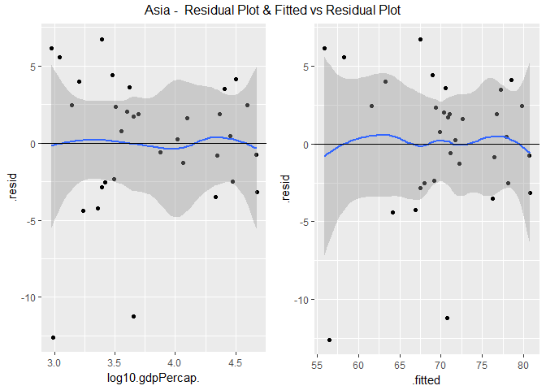

``` r
rm(conasia.lo, conasia.lo.df, conasalo, asiafr.lo)

# coneurlo=ggplot(coneurope.lo.df,aes(x = log10.gdpPercap., y = .resid))+ geom_point()+ geom_smooth()+geom_abline(slope = 0, intercept = 0)
# 
# eurofr.lo = ggplot(coneurope.lo.df,aes(x =.fitted, y = sqrt(abs(.resid))))+ geom_point()+ geom_smooth()+geom_abline(slope = 0, intercept = 0)
# grid.arrange(coneurlo, eurofr.lo, ncol=2, top="Europe -  Residual Plot & Fitted vs Residual Plot")

coneurlm=ggplot(coneurope.lm.df,aes(x = log10.gdpPercap., y = .resid))+ geom_point()+ geom_smooth()+geom_abline(slope = 0, intercept = 0)

eurofr.lm = ggplot(coneurope.lm.df,aes(x =.fitted, y = sqrt(abs(.resid))))+ geom_point()+ geom_smooth()+geom_abline(slope = 0, intercept = 0)
grid.arrange(coneurlm, eurofr.lm, ncol=2, top="Europe -  Residual Plot & Fitted vs Residual Plot")
```

    ## `geom_smooth()` using method = 'loess'
    ## `geom_smooth()` using method = 'loess'

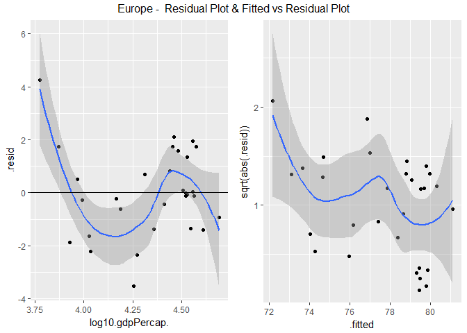

``` r
#rm(coneurope.lo, coneurope.lo.df, coneurlo, eurofr.lo)
rm(coneurope.lo, coneurope.lo.df, coneurlo, eurofr.lm)

#rm(cont.lm, conafrica.lm, conamericas.lo, conasia.lo, coneurope.lo, conafrica.lm.df, conamericas.lo.df, conasia.lo.df, coneurope.lo.df)
rm(cont.lm, conafrica.lm, conamericas.lo, conasia.lo, coneurope.lm, conafrica.lm.df, conamericas.lo.df, conasia.lo.df, coneurope.lo.df)
```

The scatter plots describing the correlation between GDP, life expectancy, time and population per continent are given below.

#### Asia

``` r
ggpairs(continent.asia, columns = 3:6)+ 
  labs(title = 'Asia - Scatter Plot between GDP, Life Expectancy, Time and Population')
```

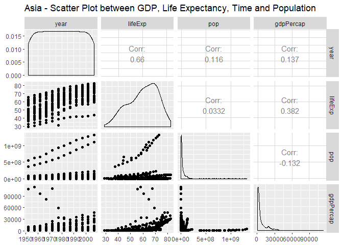

#### Africa

``` r
ggpairs(continent.africa, columns = 3:6)+ 
  labs(title = 'Africa - Scatter Plot between GDP, Life Expectancy, Time and Population')
```

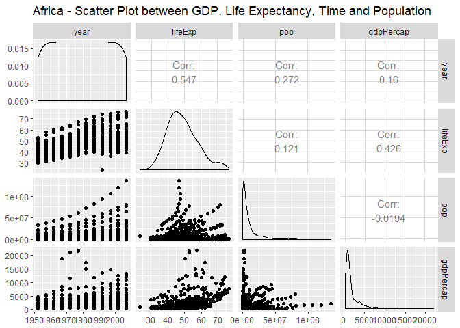

### Americas

``` r
ggpairs(continent.america, columns = 3:6)+ 
  labs(title = 'America - Scatter Plot between GDP, Life Expectancy, Time and Population')
```

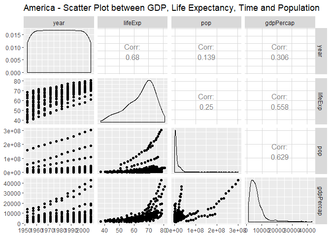

#### Europes

``` r
ggpairs(continent.europe, columns = 3:6)+ 
  labs(title = 'Europe - Scatter Plot between GDP, Life Expectancy, Time and Population')
```

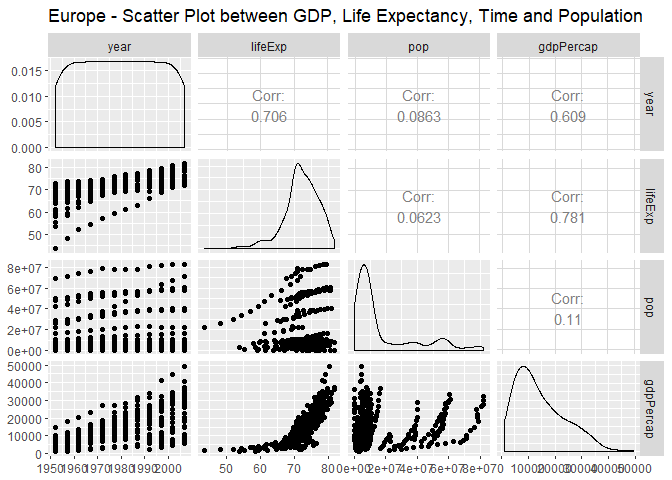

#### Oceania

``` r
ggpairs(continent.oceania, columns = 3:6)+ 
  labs(title = 'Oceania - Scatter Plot between GDP, Life Expectancy, Time and Population')
```

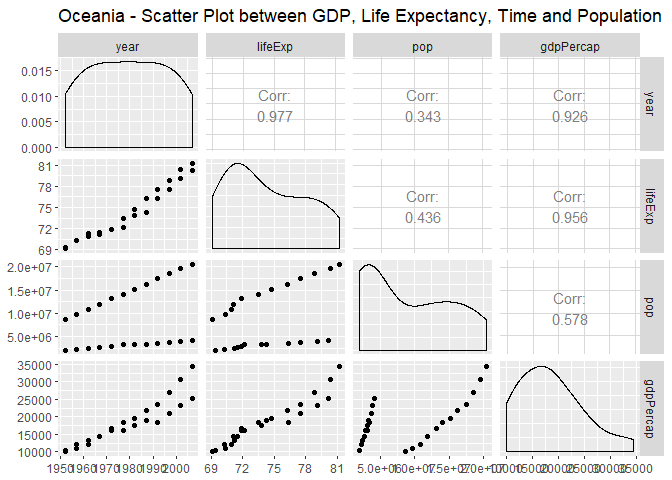

``` r
rm(continent.asia,continent.europe,continent.africa,continent.america,continent.oceania)
```

[1] All log transformations have been performed with base 10.
