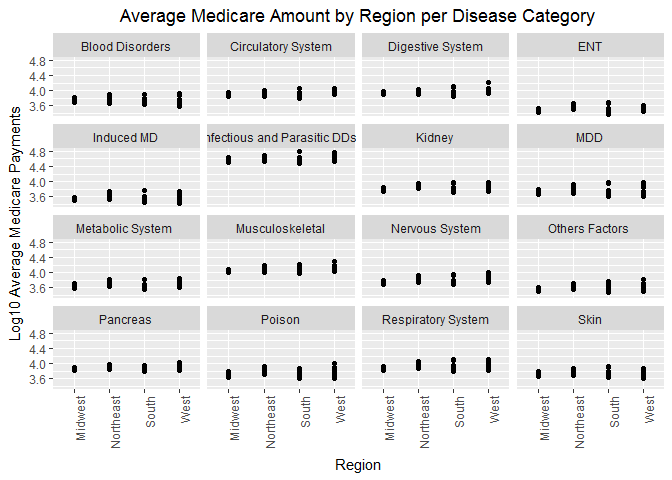
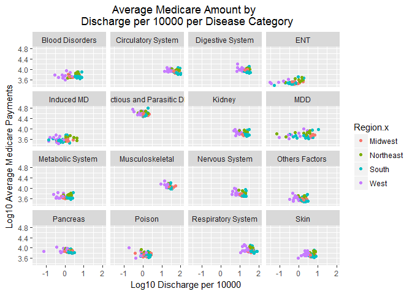
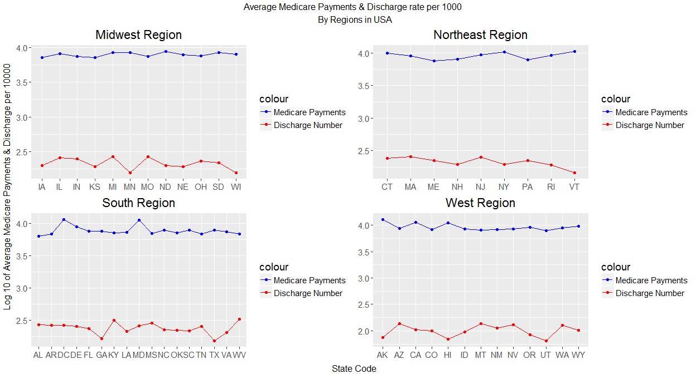
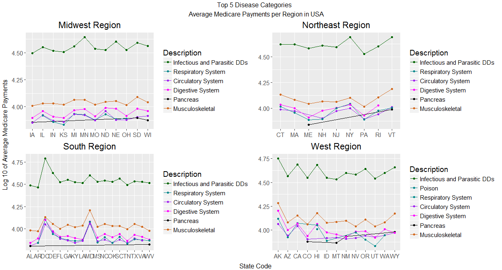
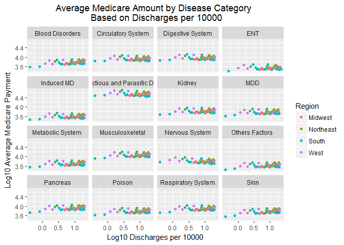
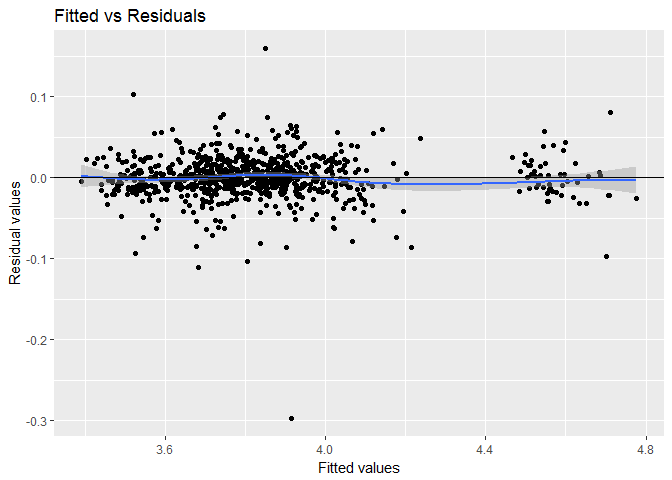

Introduction:
=============

The United States national debt amounting to $20 trillion has Health Care spending as its driving factor. Federal Medicaid spending has risen to $389 billion since 2008 and is projected to soar to $650 billion in a decade.

Medicaid is a joint federal-state program that provides health coverage or nursing home coverage to certain categories of low-asset people, including children, pregnant women, parents of eligible children, people with disabilities and elderly needing nursing home care. The system allows for the states to determine the recipients who can be eligible for Medicaid. \[Credit: [Medicaid](https://en.wikipedia.org/wiki/Medicaid)\]

Medicare is the federal health insurance program for:

-   People who are 65 or older
-   Certain younger people with disabilities
-   People with End-Stage Renal Disease (permanent kidney failure requiring dialysis or a transplant, called ESRD) \[Credit: [Medicare](https://www.medicare.gov/sign-up-change-plans/decide-how-to-get-medicare/whats-medicare/what-is-medicare.html)\]

Medicaid provides health coverage for 74.6 million low-income and disabled Americans, as described above. \[Credit: [Medicare vs Medicaid](https://www.medicareinteractive.org/get-answers/medicare-basics/medicare-coverage-overview/differences-between-medicare-and-medicaid)\]

The Trump presidency is looking to curb the funds for certain group of people whom they claim are physically capable of earning an income above the federal poverty line. As of December, 18 states were waiting for CMS to decide whether to approve substantive waivers to reshape their Medicaid programs, many of them by making it harder for people to qualify for or maintain their benefits. Based on the rate per discharge categorized by the disease group, the government allocates the Medicare funds for the hospitals covered under this program. This led us to explore the Medicare insurance data to analyze the government spending patterns on the type of diseases the government invests in and if it has a relationship with the number of discharged people with that disease. \[Credit: [Governing.com](http://www.governing.com/topics/politics/gov-2017-9-issues-to-watch.html)\]

### Research Question - Does increase in the discharge count increase the Average Medicare Payment Amount when categorized by disease group?

To answer this, we focus on performing data analysis on the Provider Utilization and Payment Data Inpatient Public Use File (referred to as "Inpatient PUF") prepared by the Centers for Medicare & Medicaid Services (CMS). It contains hospital-specific charges for more than 3,000 U.S. hospitals. As described above, the hospitals receive Medicare based on a rate per discharge categorized by the Medicare Severity Diagnosis Related Group (MS-DRG). The Inpatient PUF is available for the years 2011 through 2015. The MS-DRG is limited to the top 100 most frequently billed discharges.

Data Description
================

We will consider three explanatory variables, DRG Description, Provider State, and Total Discharges, and one response variable, Average Medicare Payments, for our analysis.

-   DRG\_Description: Comprises the code & description identifying the Diagnosis Related Group(DRG). DRGs are a classification system that groups similar clinical conditions (diagnoses) and the procedures furnished by the hospital during the stay. In simple terms, they are different categories for various classes of diseases.

-   Provider\_State: State in which the provider (hospital) of the Medicare Services is physically located.

-   Discharges: The number of discharges billed by the provider for inpatient hospital services.

-   Average\_Medicare\_Payments: The average amount that Medicare pays to the provider for Medicare's share of the MS-DRG. Average Medicare payment amounts include the MS-DRG amount, teaching, disproportionate share, capital, and outlier payments for all cases. Medicare payments DO NOT include beneficiary co-payments and deductible amounts nor any additional payments from third parties for coordination of benefits.

\[Credit: [CMS](https://data.cms.gov/api/views/97k6-zzx3/files/4496fc4f-5f10-43e4-8183-b6da867f8981?download=true&filename=Medicare_Hospital_Inpatient_PUF_Methodology_2017-08-30.pdf)\]

### Data Preprocessing:

-   We have consolidated the 100 DRG description into one of 25 Major Diagnostic Categories (MDC) that generally correspond to a single organ system. \[Credit: [MDC](https://en.wikipedia.org/wiki/Major_Diagnostic_Category)\]

-   We added a new factor variable to categorize States by their Regions.

-   Referencing state population defined in Wikipedia, we added a new explanatory (continuous) variable, "Proportion of Discharges per 10000" of the state population.

Descriptive Analysis:
=====================

### Average Medicare Payments in different US regions

As the first step of our analysis, we plot the Average Medicare Payments against different US regions and facet it by different diseases. We have transformed the average medicare payment to a log (base 10) scale to increase their variability.

We see that among all the diseases for all the regions,

-   Infectious and Parasitic Diseases and Disorders (Infectious and Parasitic DDs) show the highest Average Medicare Payments of about $50100.
-   Alcohol or Drug Induced Mental Disorder (Induced MD) and Ear, Nose, and Throat (ENT) have the lowest Average Medicare Payments of approximately $3000.
-   Midwest has the lowest Average Medicare Payments of about $3000.
-   West has the highest Average Medicare Payments of around $12000.

We see that Infectious and Parasitic Diseases is 10 times more expensive than Induced MD and ENT. West is four times as expensive as compared to Midwest.

Medicare for Infectious and Parasitic DDs cover diseases caused by parasites, virus, etc. Parasites generally harm the body of the host in order to survive. They can cause damages to the functioning of multiple organs in a human body, such as in kidney or digestive system. They also have a high cost associated with its tests and diagnosis. Parasitic infections have been shown to flourish in settings of warm climate and extreme poverty as found in the southern states of the US. And so, the southern region is more prone to such parasitic diseases as compared to other regions. \[Credit: [NTD in USA](http://journals.plos.org/plosntds/article?id=10.1371/journal.pntd.0003012)\]

Between 2013 and 2015, an estimate of 54.4 million US adults (22.7%) annually have been diagnosed with some form of arthritis. Women are more likely to be affected by arthritis than men especially over the age of 50 (who will be covered by Medicare). Thus, it's standing as the second highest average Medicare payment with an amount of $15000 makes sense. \[Credit: [CDC arthritis](https://www.cdc.gov/arthritis/data_statistics/arthritis-related-stats.htm) & [OA](https://www.cdc.gov/arthritis/basics/osteoarthritis.htm)\]

Most of the Americans are affected by diseases related to the circulatory organs. Men are affected by cardiovascular diseases more than female at an average age of 60 years or more (who will be covered by Medicare). Based on CDC statistics in the United States,

-   About 610000 people die of heart disease every year(i.e; 1 in every 4 deaths)
-   Coronary heart disease (CHD), most common heart disease, kills over 370000 people annually.
-   Every year about 735,000 Americans has a heart attack.

And so, it has a high average medicare payment amount of $10000. \[Credit: [CDC](https://www.cdc.gov/heartdisease/facts.htm) & [statistia](https://www.statista.com/statistics/671371/coronary-heart-disease-prevalence-us-adults-by-age-and-gender/)\]

This low value of about 3000$ for the Average Medicare payments for Induced MD is straightforward as insurance policies either cover a minimal amount or do not provide coverage for people who tend to be alcoholic or addicts.

### Average Medicare Payments by Discharge per 10000

Next, we move onto studying the relationship between average Medicare payments and discharges per 10000 categorized by diseases. Again, we have transformed the average medicare payment and discharges per 10000 to a log (base 10) scale to increase their variability.

From the "Average Medicare Amount by Discharge per 10000 per Disease Category" graph, we have the below observations.

Among all the regions:

-   West region has higher Average Medicare Payments of about 7943$. This is pretty obvious as the cost of living along the West Coast is higher. It has the smallest Discharges rate at 3 people per 10000 population.
-   South and Northeast have the highest Discharge rate at around 80 people per 10000 population, with South being on top with highest Discharge rate at 100 people per 10000 population for most of the diseases.

Diseases observations are given below.

-   ENT and Induced MD has lowest Average Medicare Payments of about $3000 and discharges rate with less than 1 person per 10000 population.
-   Circulatory, Digestive, Kidney, Nervous, Musculoskeletal and Respiratory Systems have a higher discharge rate of 31 people per 10000 population with average Medicare amount around $12000.
-   Metabolic system, the blood disorder, Mental Diseases and Disorders (MDD) and other factors have a discharge rate of 3 people per 10000 population with an average Medicare payment of $5000.
-   Poison, Pancreas, and Skin have a discharge rate at 3 people per 10000 population with average Medicare amount around $7500.
-   Last but not the least, Infectious and Parasitic Diseases doesn't have equally overwhelming discharge rate, typically 1 person per 10000 population although it has the highest Average Medicare Payments at above $50000.

As detailed in the previous analysis (Average Medicare Payments in different US regions), the United States of America has the highest percentage of people suffering from heart-related diseases and arthritis when compared to other disease categories. And so it seems reasonable that cardiovascular diseases and musculoskeletal systems have higher discharge rates of about 31 people per 10000 population.

### Average Medicare Payments by Discharge per 10000 & Top Five Diseases analyzed by each state

Now we analyze the average payments in each state of the regions in the USA - its average Medicare payments and discharge rate and compare it with the states top five diseases.

Midwest Region:

-   Minnesota has the lowest discharge rate of about 150 per 10000 population and higher average medicare payment of approximately 8000$ as compared to other states in Midwest region. This can be attributed to the Infectious and Parasitic disease, as it receives the highest average Medicare payment compared to all states in Midwest region. In 2016, Sexually transmitted diseases and vector-borne diseases were reported to be most common infectious diseases in Minnesota, along with other diseases such as foodborne diseases and antibiotic-resistant organisms and rare diseases such as severe acute respiratory syndrome (SARS), Ebola virus disease, and Zika virus disease. These diseases will be categorized under Infectious and Parasitic DDs.

-   Wisconsin, South Dakota and Ohio, even though have a downward slope starting at a discharge rate of 250 to 150 person per 10000 population, they have higher average Medicare payments for infectious, musculoskeletal, digestive and circulatory systems disease at around $12000 when compared to other states. The average Medicare payments of these states tend to mimic the trend of top five diseases and stays at around $10000.

Northeast Region:

-   New Jersey has the highest discharge rate of about 275 people per 10000 population but does not have the highest average medicare payment compared to other states (less than $10000). Whereas New York has a lower discharge rate of about 175 people per 10000 population but has the highest average Medicare payments of approximately $10000 as compared to the other states in that region. As New York has higher average medicare payment for infectious, musculoskeletal, digestive and circulatory systems diseases its state average is the highest and New Jersey comparatively spends lower, its state average medicare payment is also lower.

-   Pennsylvania, Rhode Island and Vermont, even though have a downward slope with less than 200 discharges per 10000 population, they have a higher slope for average Medicare payments for infectious disease, musculoskeletal, digestive and circulatory systems. And so, have higher average Medicare payments when compared with the other states in that region. Rhode Island and Vermont are also states having the highest cost of living in the region and so they tend to pay more for hospital charges.

South Region:

-   Georgia and Texas have the lowest discharge rate of about 150 per 10000 population as compared to the other states but they have comparable average Medicare payments of around $6000. This also follows the trend of average Medicare payments of the top five diseases.

-   Maryland and District of Columbia, even though have a lower discharge rate of about 250 people per 10000 population, have the highest average Medicare payments of around $12500. They also have the highest average Medicare payments for the top five diseases at around $17000 as compared to other states. Their cost of living is also the highest in the Southern region.

West Region:

-   Hawaii and Arkansas have lower discharge rate at around 71 people per 10000 population but highest average Medicare payments of about $11000. They have the highest average Medicare payments for the top five diseases as compared to other states.

-   Utah has one of the lowest discharge rates of around 60 people per 10000 population and lower average Medicare payments of about $9000 for the top five diseases. Thus, it has the lowest average Medicare payments as compared to other states.

And so, we find that the average Medicare payments are more dependent on the disease category and the state but lesser dependent on the discharge rate.

Predictive Analysis:
====================

Since the average Medicare payment is a continuous variable, we fit a linear model. Based on the AIC, we have used discharge rate, State, and the disease category to predict average Medicare payment. We also decided to include an interaction between discharge rate and the disease category. We have transformed the average medicare payment and discharge rate to a log (base 10) scale to increase their variability for fitting the model and prediction.

Our model has captured 98.82719 % of the variation in the Average Medicare Payments.

Northeast and Midwest are on the higher end of the discharge rate with about 30 discharges per 10000 population as compared to the other regions. West and South have a number of states having more discharges with few states having lower discharge rate. Infectious and parasitic diseases have the highest average Medicare payments at about $40000. This is followed by musculoskeletal, digestive, circulatory diseases which have an average Medicare payment of $10000.

Conclusion:
===========

Initially, we had hypothesized that average Medicare payments are more dependent on discharge rate as mentioned by the CMS. But analyzing the graphs we find that they are more dependent on the disease category in each state. Apart from this, the presence of other confounding variables like cost of living, most commonly occurring diseases, the climate of the state, living conditions, etc also affect the average Medicare payments.

For future analysis, we can also include referral description. This explanatory variable describes the hospitals which do not treat certain patients due to lack of advanced medical facilities. And so, they refer the patient to other hospitals within or outside that state. This affects the average Medicare payment of that hospital and indirectly the average Medicare payment for that state. We can also perform a city-wise analysis to predict the average Medicare payments. The type and number of patients treated (eg. patients below poverty line) has a direct impact on the average Medicare amount and so further analysis on these variables can also be helpful.

Appendix:
=========

